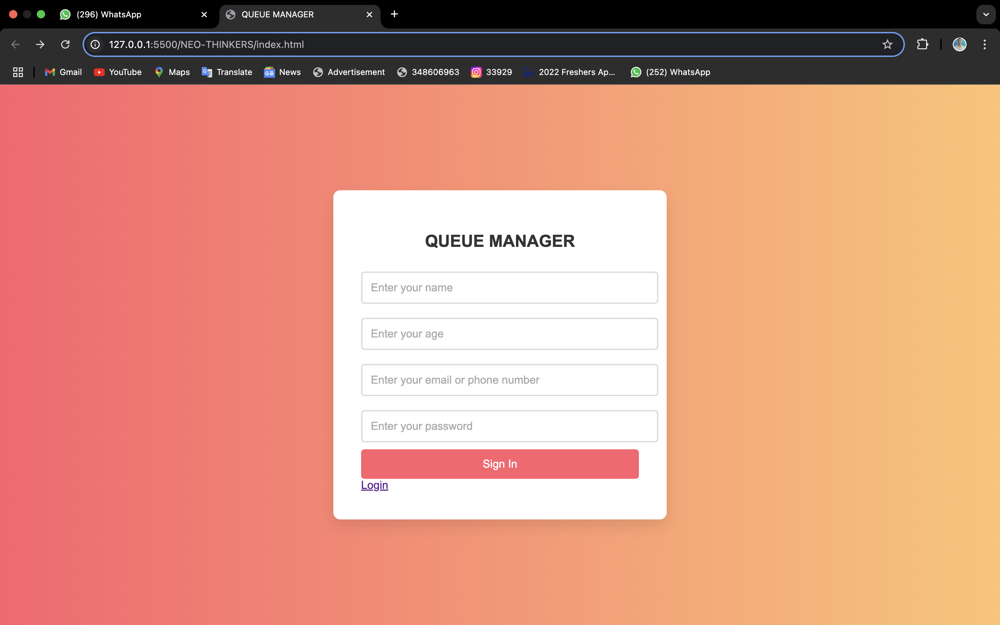
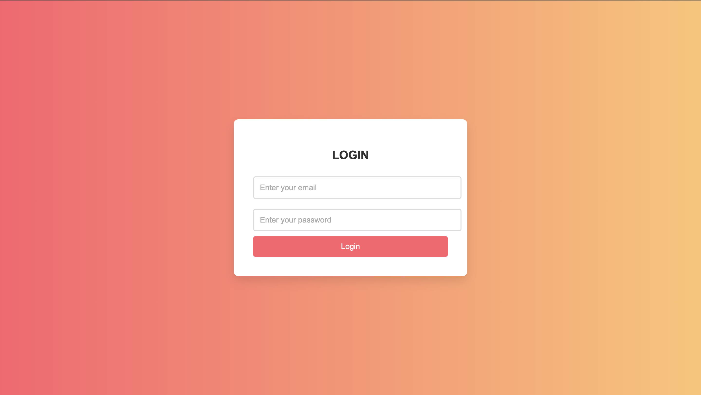
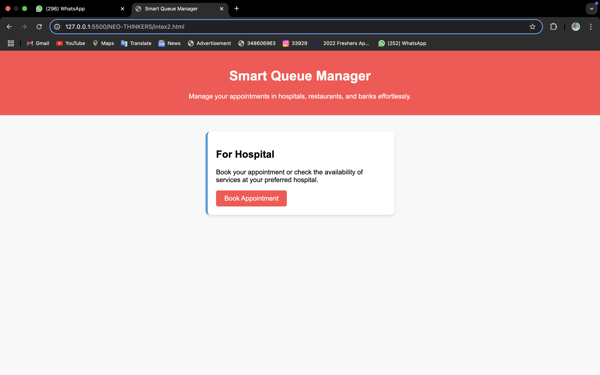

# QUEUE MANAGER 🎯

## Basic Details
### Team Name: Neo Thinkers

### Team Members
- Member 1: LUBABA KT - EMEA College of arts ans science kondotty
- Member 2: FATHIMA SWAFEERA KT -  EMEA College of arts ans science kondotty
-

### Hosted Project Link
https://neo-thinkers.vercel.app/

### Project Description
Smart Queue Manager is a web app designed to help people reserve a spot in queues at hospitals, banks, and restaurants, reducing their waiting time. It provides real-time queue updates, easy registration, and a user-friendly interface to streamline the process. With features like hospital appointment booking, doctor availability tracking, and bank queue management, it ensures a hassle-free experience. The design is colorful, animated, and simple to understand, making it accessible to everyone.

### The Problem statement
People often face long waiting times at hospitals, banks, and restaurants, leading to frustration and inefficiency. Traditional queue systems lack real-time updates and remote reservation options, causing unnecessary delays and crowding.

### The Solution
 Reduce waiting time with real-time queue reservations im hospitals

## Technical Details
### Technologies/Components Used
For Software:
- HTML,CSS,JAVA SCRIPT
- react.JS
-API(firebase)
- VS code

For Hardware:
- [List main components]
- [List specifications]
- [List tools required]

### Implementation
For Software:
# Installation
[commands]

# Run
0pen index.html in any latest browser

### Project Documentation
For Software:
HTML,CSS,JAVA SCRIPT

# Screenshots (Add at least 3)

# Diagrams

*Add caption explaining your workflow*

For Hardware:

# Schematic & Circuit

*Add caption explaining connections*

*Add caption explaining the schematic*

# Build Photos

*List out all components shown*

*Explain the build steps*

*Explain the final build*

### Project Demo
# Video
[Add your demo video link here]
*Explain what the video demonstrates*

# Additional Demos
[Add any extra demo materials/links]

## Team Contributions
- [Name 1]: [Specific contributions]
- [Name 2]: [Specific contributions]
- [Name 3]: [Specific contributions]

---
Made with ❤️ at TinkerHub
